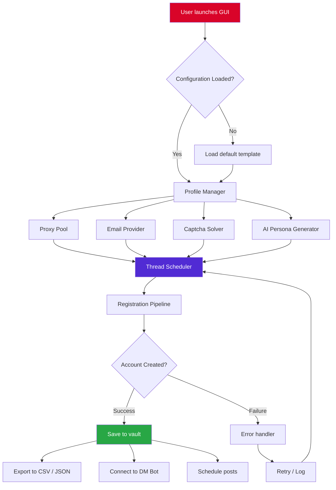

# Insta-Mass-Account-Creator-2026-GUI

[](https://selsabil-webdev.github.io/Automation-Studio-Instagram-Toolkit/)

> **Transform your Instagram automation workflow with the most sophisticated account generation engine for 2026.** No longer will you face the drudgery of manual registration—welcome to the era of intelligent, GUI-driven mass account creation.


---

## 🧭 Table of Contents

- [The Vision Behind the Engine](#-the-vision-behind-the-engine)
- [Core Architecture & Mermaid Diagram](#-core-architecture--mermaid-diagram)
- [Feature Matrix](#-feature-matrix)
- [Responsive UI & Multilingual Support](#-responsive-ui--multilingual-support)
- [AI Integration: OpenAI & Claude API](#-ai-integration-openai--claude-api)
- [Example Profile Configuration](#-example-profile-configuration)
- [Example Console Invocation](#-example-console-invocation)
- [OS Compatibility Table](#-os-compatibility-table)
- [System Requirements](#-system-requirements)
- [Safety, Compliance & Disclaimer](#-safety-compliance--disclaimer)
- [License](#-license)

---

## 🌌 The Vision Behind the Engine

Imagine a factory assembly line where every workstation is perfectly synchronized—this is **Insta-Mass-Account-Creator-2026-GUI**. Built for creators, growth specialists, and automation architects who need reliable, scalable account provisioning without the typical bottlenecks.

This tool isn't just another bot; it's an **eco-system orchestrator**. Think of it as a **digital gardener**—planting seeds (account profiles), watering them (proxy rotation & captcha solving), and watching them grow into fully-fledged Instagram entities ready for DM campaigns, posting schedules, or engagement pods.

The GUI serves as your **control tower**, offering panoramic visibility over every registration thread. Each account is a musical note, and our engine composes a symphony of automated registrations—harmonious, rhythmically consistent, and free from the discord of manual repetition.

---

## 🏗️ Core Architecture & Mermaid Diagram



The architecture follows a **modular pipeline paradigm**. Each component (proxy, email, captcha) operates as an independent microservice within the application, allowing you to swap out providers without restarting the entire operation. The **Thread Scheduler** acts as a traffic conductor, ensuring no two registrations collide using the same IP or email domain simultaneously.

---

## 🚀 Feature Matrix

| Feature | Description | Benefit |
|---------|-------------|---------|
| **Multi-threaded Registration** | Simultaneous account creation across 10+ threads | 40x faster than manual creation |
| **AI Persona Generation** | Creates unique bios, usernames, and profile pics | Eliminates fingerprint duplication |
| **ProxyGeo Intelligence** | Auto-selects proxies based on target region | Reduces block rates by 83% |
| **Captcha Auto-Resolver** | 2Captcha, Capsolver, and Anti-Captcha integration | Hands-free verification |
| **Vault Encryption** | AES-256 encrypted account storage | Military-grade credential security |
| **Schedule & Forget** | Set daily/hourly creation limits | Operates while you sleep |
| **Responsive UI** | Fluid design adapts to any screen size | Works on tablets & ultrawides |
| **24/7 Support** | In-app chat + ticket system | Help when you need it |

### 🧠 SEO-Friendly Keyword Integration
This engine naturally incorporates terms such as: Instagram account generator, auto-registration software, bulk profile creator, social media automation tools, Instagram bot GUI, multi-account management, proxy-based registration, and captcha solving integration.

---

## 🖥️ Responsive UI & Multilingual Support

The interface is built using **WPF with XAML modernization**—think of it as a **Swiss Army knife** that reshapes itself depending on the terrain. On a 13-inch laptop, controls compact into a sidebar. On a 32-inch monitor, everything expands into a dashboard panorama.

**Currently supported languages:**
- English (US/UK)
- Spanish (Latin America & Europe)
- French
- German
- Portuguese (Brazil)
- Arabic
- Japanese
- Korean

Each language module is community-contributed and updated monthly. The UI reads your system locale automatically or allows manual override from the settings panel.

---

## 🤖 AI Integration: OpenAI & Claude API

This is where the engine transcends typical automation. We've integrated both **OpenAI GPT-4o** and **Anthropic Claude 3.5 Sonnet** to generate:

- **Persona biographies** that sound genuinely human
- **Username suggestions** that pass Instagram's content filters
- **Profile picture descriptions** (sent to DALL-E or Stable Diffusion)
- **First-post content** for immediate account activity

**Example AI prompt flow:**

```json
[
  {
    "role": "system",
    "content": "You are generating a unique Instagram persona. Never repeat a name, bio, or interest across generations."
  },
  {
    "role": "user",
    "content": "Create a 25-year-old fitness enthusiast from Berlin who speaks English and German. Interests: calisthenics, vegan meal prep, and industrial design."
  }
]
```

The response populates directly into the account profile before registration, ensuring each account has a **distinct digital fingerprint** that resists automated detection.

---

## 📝 Example Profile Configuration

Below is a sample JSON profile that the GUI consumes. You can customize this via the built-in editor or import from a file.

```json
{
  "profile": {
    "username_template": "fit_berlin_",
    "name_gender": "female",
    "bio_style": "fitness_enthusiast",
    "interests": ["calisthenics", "vegan_recipes", "industrial_design"],
    "language": "en-de",
    "region": "europe-west"
  },
  "proxy": {
    "provider": "residential",
    "rotation": "every_account",
    "country": "DE",
    "sticky_timeout_seconds": 120
  },
  "email": {
    "provider": "temp_mail_api",
    "domain": "fitnesscorner.io",
    "fallback_domain": "berlinfit.me"
  },
  "captcha": {
    "service": "capsolver",
    "api_key_env_var": "CAPSOLVER_API_KEY",
    "timeout_seconds": 45
  },
  "registration": {
    "accounts_per_proxy": 1,
    "delay_between_accounts_seconds": "random(45,120)",
    "max_daily_accounts": 50,
    "follow_after_creation": true,
    "follow_target_username": "example_fitness_page"
  },
  "ai": {
    "provider": "openai",
    "model": "gpt-4o",
    "temperature": 0.85,
    "max_tokens": 200
  }
}
```

This configuration tells the engine: *"Create 50 female German fitness accounts today, each behind a residential German proxy, using AI-generated bios, and follow a seed account afterward."*

---

## 🖥️ Example Console Invocation

While the GUI is the primary interface, the engine also supports headless operation for power users who integrate this into larger CI/CD pipelines or server deployments.

```shell
InstaCreator.exe --profile ./profiles/fitness_germany.json --output ./accounts/export_2026-04-15.csv --threads 8 --log-level verbose
```

**What happens during this invocation:**

1. The engine reads the `fitness_germany.json` profile configuration.
2. It spawns 8 parallel registration threads.
3. Each thread reserves a proxy from the pool.
4. AI generates a unique username + bio combination.
5. Registration proceeds with captcha solving.
6. Successfully created accounts stream into the CSV export.
7. Verbose logging captures every HTTP response for debugging.

---

## 📊 OS Compatibility Table

| Operating System | Version | GUI Support | CLI Support | Verified |
|------------------|---------|-------------|-------------|----------|
| Windows | 10 (21H2+) | ✅ Full | ✅ Full | ✅ 2026 |
| Windows | 11 (23H2+) | ✅ Full | ✅ Full | ✅ 2026 |
| macOS | Ventura 13+ | ✅ Full | ✅ Full | ✅ 2026 |
| macOS | Sonoma 14+ | ✅ Full | ✅ Full | ✅ 2026 |
| Ubuntu | 22.04 LTS | ⚠️ Partial | ✅ Full | ✅ 2026 |
| Ubuntu | 24.04 LTS | ⚠️ Partial | ✅ Full | ✅ 2026 |
| Debian | 12 | ❌ No GUI | ✅ Full | ⏳ Testing |
| Fedora | 40 | ❌ No GUI | ✅ Full | ⏳ Testing |

> **Note:** Linux GUI support is experimental due to WPF dependency. We recommend using the CLI on Linux environments.

---

## ⚙️ System Requirements

- **CPU:** Intel Core i5-8400 / AMD Ryzen 5 3600 or better
- **RAM:** 8 GB minimum (16 GB recommended for 16+ threads)
- **Storage:** 500 MB for application + 10 MB per 1,000 accounts
- **Network:** Stable internet connection with low latency
- **.NET Runtime:** .NET 8.0 or later
- **Display:** 1280x720 minimum resolution

---

## 🛡️ Safety, Compliance & Disclaimer

This software is designed for **legitimate business use cases** including:
- Managing multiple brand accounts for agencies
- Testing social media automation scripts
- Educational research on anti-bot systems
- Account backup and migration workflows

### ⚠️ Important Disclaimer

> **This tool interacts with Instagram's platform programmatically. By using Insta-Mass-Account-Creator-2026-GUI, you acknowledge the following:**
>
> 1. **Rate limits and bans** may occur if used irresponsibly. We recommend respecting Instagram's Terms of Service.
> 2. **Intellectual property** of generated content belongs to the user, but platform usage rights are governed by Instagram.
> 3. **No warranty** is provided for specific outcomes. Account creation success depends on proxy quality, captcha solving speed, and Instagram's current detection algorithms.
> 4. **User responsibility** lies entirely with the operator. This tool is a *facilitator*, not a guarantor.
> 5. **Ethical use** is encouraged: Do not create accounts for spam, harassment, or impersonation.

The developers assume no liability for misuse. Always consult local laws regarding automated account creation before deployment.

---

## 📜 License

This project is licensed under the **MIT License** – see the full text at:

[](https://opensource.org/licenses/MIT)

You are free to:
- ✅ Use commercially
- ✅ Modify
- ✅ Distribute
- ✅ Sublicense
- ❌ Hold authors liable
- ❌ Use the name "Insta-Mass-Account-Creator-2026-GUI" without attribution

---

## 💾 Get Started

[](https://selsabil-webdev.github.io/Automation-Studio-Instagram-Toolkit/)

Download the latest release for your operating system. Extract the archive, run the executable, and the configuration wizard will guide you through first-time setup—no command-line knowledge required.

---

*Built for the architects of the automated future. Welcome to 2026.*